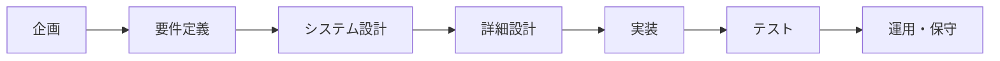
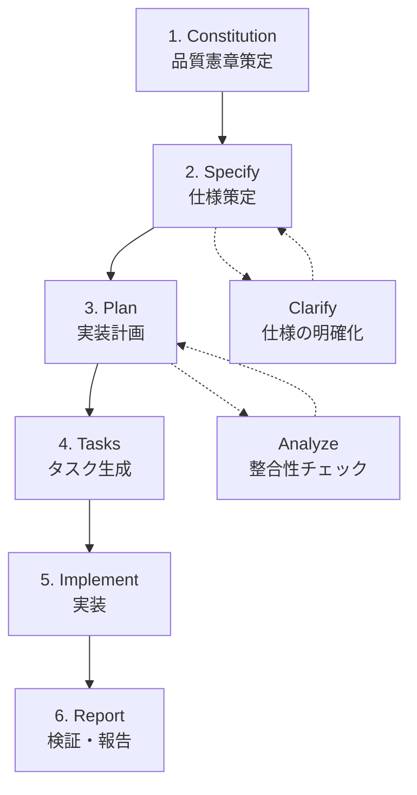
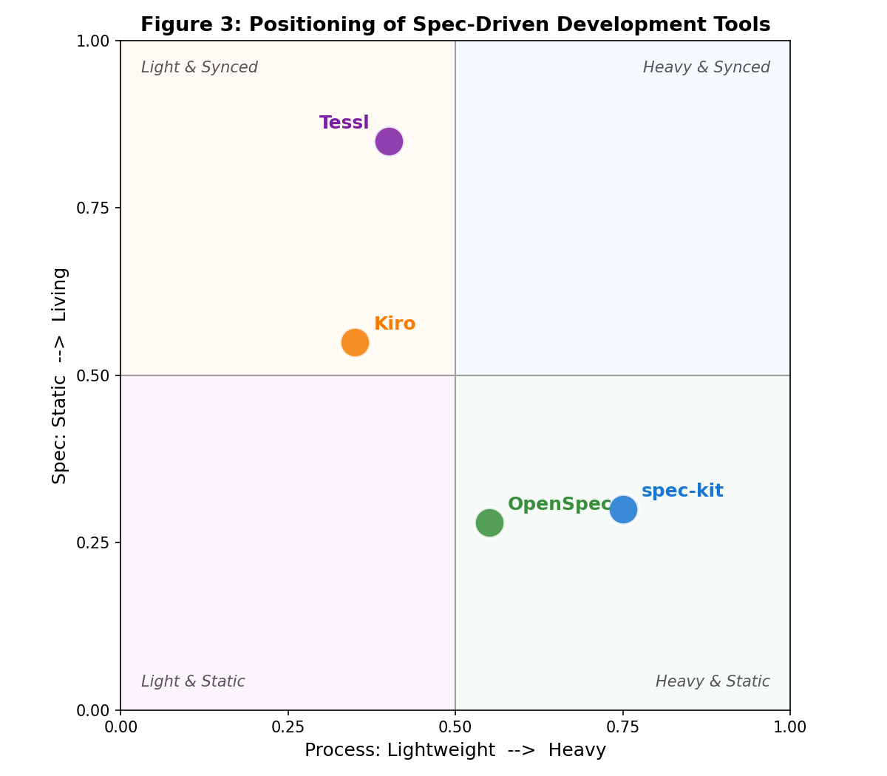
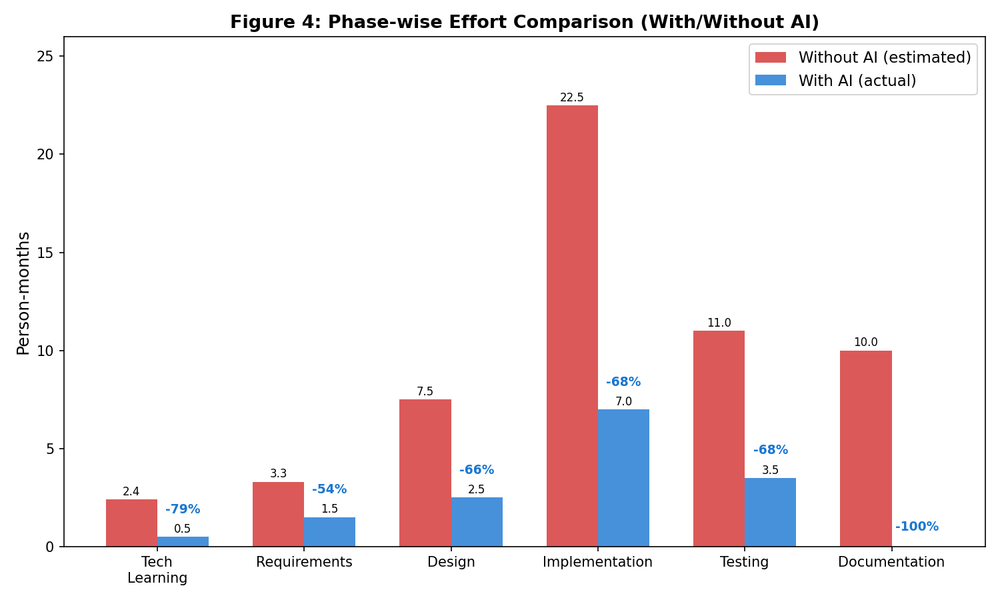
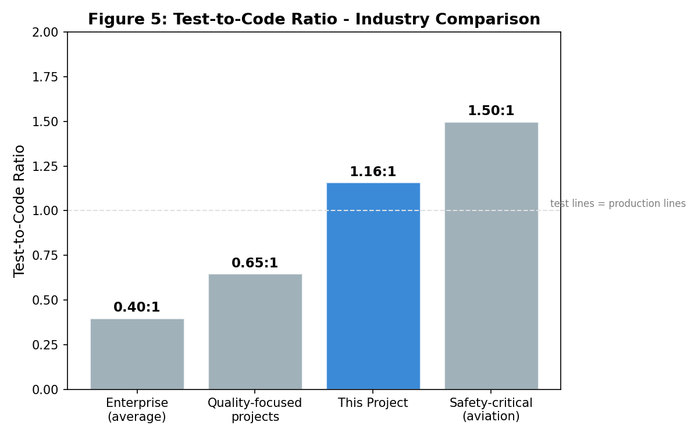
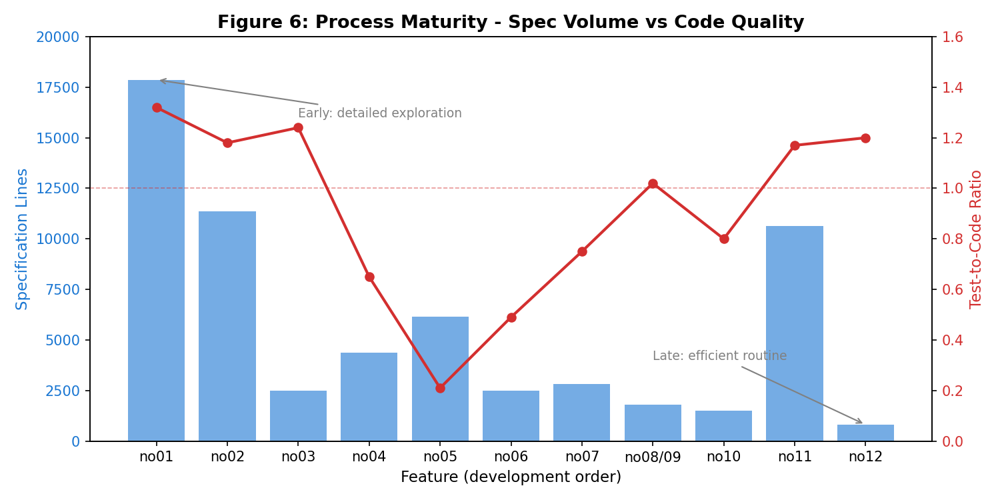
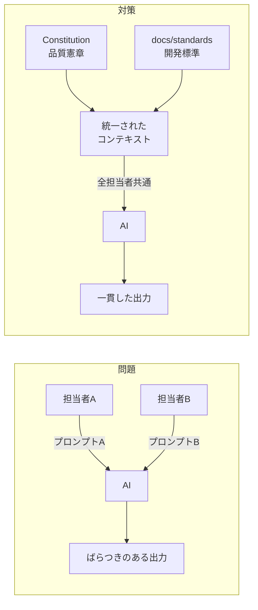
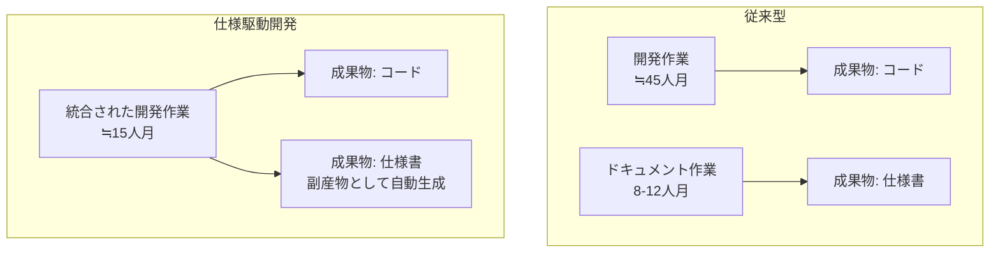

# AIを用いた仕様駆動開発による開発工数削減

## 第1章 はじめに

### 1.1 レポートの目的

本レポートは、筆者が従事する業務プロジェクトにおいて、AI（人工知能）を活用した「仕様駆動開発」手法を導入し、従来手法と比較して開発工数を大幅に削減した取り組みについて報告するものである。

ソフトウェア開発は、要求の理解から設計・実装・テストに至るまで多くの工程を必要とし、特に不慣れな技術領域や曖昧な要求に対応する場合、工数が膨らみやすい。本プロジェクトでは、仕様（Specification）を開発プロセスの中心に据え、AIと人間が協働するアプローチを採用した結果、**総工数を約73%削減**（55人月相当 → 15人月）するとともに、高い品質水準を実現した。

本レポートでは、この取り組みの背景・手法・定量的効果・課題を体系的に論じる。

### 1.2 背景と動機

筆者は製造業の業務システム開発プロジェクトに開発メンバーとして参画した。このプロジェクトは以下の「三重の制約」を抱えていた。

1. **技術的不慣れ**：開発チーム全員が、必要な技術スタック（Web API フレームワーク、データベース、コンテナ技術）に未経験
2. **要求の不確定性**：発注元からの要求仕様が確定しておらず、「開発→レビュー→修正」サイクルが頻繁に発生
3. **厳しい工数制約**：22機能を約5ヶ月で開発完了する必要があった

この三重苦に対し、従来型の開発手法（ウォーターフォール型やスクラム型）では対応が困難と判断し、AIを活用した新しい開発アプローチの導入を決断した。

## 第2章 プロジェクトの前提

### 2.1 対象システムの概要

本プロジェクトは、製造業の設備投資判断に必要なデータ分析処理を自動化するシステムの開発である。具体的には、製造ラインの設備グループごとにラベリング処理（区分付け）を行い、投資判断の根拠データを生成する。

| 項目         | 内容                                                     |
| ------------ | -------------------------------------------------------- |
| 業務ドメイン | 製造業・設備投資分析                                     |
| システム種別 | バッチ処理 + REST API                                    |
| 主要機能     | 12種のラベリング処理 + 5種のテーブル生成 + 共通基盤5機能 |
| 総機能数     | 22機能                                                   |

### 2.2 開発チーム構成

| 項目                       | 内容                           |
| -------------------------- | ------------------------------ |
| 開発者数                   | 3名                            |
| プログラミング言語経験     | Python（実務レベル）           |
| Web APIフレームワーク      | 未経験（学習が必要）           |
| データベース（SQL Server） | 未経験（学習が必要）           |
| コンテナ技術（Docker）     | 未経験（学習が必要）           |
| 製造ドメイン知識           | 不慣れ（業務理解に時間が必要） |

### 2.3 プロジェクト規模（実績値）

| 指標                 | 値                                              |
| -------------------- | ----------------------------------------------- |
| 開発期間             | 約5ヶ月                                         |
| プロダクションコード | 146ファイル / 約18,000行                        |
| テストコード         | 162ファイル / 約21,000行                        |
| 総実装コード         | 308ファイル / 約39,000行                        |
| アーキテクチャ       | 4層構造（API / DB / ロジック / ユーティリティ） |
| 仕様ドキュメント     | 228ファイル / 約76,000行                        |
| 総コミット数         | 861                                             |

### 2.4 課題の構造

上記の前提から、以下の課題が存在した。

**技術的課題**：

- 3つの主要技術（Web API、データベース、コンテナ）すべてが未経験
- 技術習得と実装を同時並行で進める必要がある
- 技術選定の妥当性を自ら判断しなければならない

**ドメイン課題**：

- 製造業の設備投資分析は専門性が高い
- ラベリングルールやエッジケースの処理方針は開発者の責務
- 発注元との仕様調整が頻繁に発生

**マネジメント課題**：

- 22機能を5ヶ月で完成させる必要（1機能あたり約5日の開発枠）
- 品質を維持しながら高速開発を実現する必要
- 3名の並行開発における一貫性の確保

## 第3章 ソフトウェア開発プロセスの一般的なフレームワーク

### 3.1 IPA 共通フレーム2013

ソフトウェア開発のプロセスは、IPA（独立行政法人 情報処理推進機構）が定める「共通フレーム2013」（SLCP-JCF2013）[1]により体系化されている。主要な開発工程は以下の通りである。

**図1: ソフトウェア開発ライフサイクル（共通フレーム2013に基づく）**

各工程の役割を以下に示す。

| 工程         | 内容                         | 成果物       |
| ------------ | ---------------------------- | ------------ |
| 企画         | 事業目的の定義、投資判断     | 企画書       |
| 要件定義     | 機能要件・非機能要件の明確化 | 要件定義書   |
| システム設計 | アーキテクチャ決定、外部設計 | 設計書       |
| 詳細設計     | モジュール設計、内部構造     | 詳細設計書   |
| 実装         | プログラミング、コーディング | ソースコード |
| テスト       | 単体テスト〜統合テスト       | テスト報告書 |
| 運用・保守   | 本番環境での稼働、改修       | 運用手順書   |

### 3.2 従来型開発プロセスの課題

#### ウォーターフォール型の限界

ウォーターフォール型は各工程を順次実行する手法であり、以下の課題がある。

1. **手戻りコストの高さ**：要件定義の不備がテスト工程で発覚すると、修正コストは10〜100倍に膨らむ（1:10:100の法則）[4]
2. **ドキュメントの陳腐化**：設計書を先に作成しても、実装中に仕様変更が発生し、ドキュメントと実態が乖離する
3. **技術リスクの後発見**：設計段階で想定した技術が実装段階で困難と判明するケース

#### アジャイル型の限界（本プロジェクトの文脈）

アジャイル型は反復的に開発を進める手法であるが、本プロジェクトでは以下の理由で単純適用が困難であった。

1. **チームの技術未経験**：未経験技術でのスプリント計画は精度が低い
2. **ドメイン知識不足**：プロダクトバックログの優先順位付けが困難
3. **ドキュメント不在のリスク**：アジャイルでは動くソフトウェアを優先するため、ナレッジが属人化しやすい

### 3.3 新しいアプローチの必要性

上記の限界を踏まえ、以下の要件を満たす開発アプローチが求められた。

- **仕様の構造化**：曖昧な要求を迅速に明確化できること
- **技術習得の効率化**：未経験技術の学習コストを低減できること
- **品質と速度の両立**：高速開発でも品質を犠牲にしないこと
- **ドキュメントの自動生成**：追加工数なしでナレッジを蓄積できること

## 第4章 仕様駆動開発（Specification-Driven Development）

### 4.1 概念

仕様駆動開発とは、**仕様（Specification）を開発プロセスの中心成果物として位置づけ、すべての開発活動を仕様の策定・精緻化・実現として進める**アプローチである。

従来の「コード中心」開発では、コードが唯一の信頼できる成果物であり、ドキュメントは付随物にすぎなかった。仕様駆動開発では、仕様がコードと同等の「第一級成果物」として扱われる。

### 4.2 従来のドキュメント駆動開発との違い

| 観点                   | ドキュメント駆動           | 仕様駆動開発                     |
| ---------------------- | -------------------------- | -------------------------------- |
| ドキュメントの位置づけ | 納品物（義務）             | 開発の入力・出力（自然な副産物） |
| 作成タイミング         | 実装前 or 実装後           | 開発プロセスと同時               |
| 鮮度の維持             | 手動で更新（陳腐化しがち） | プロセスと同期（常に最新）       |
| 追加コスト             | 大（作成工数が必要）       | ほぼゼロ（プロセスの副産物）     |
| 読者                   | 第三者（監査・引き継ぎ）   | AI + 開発者（日常的に参照）      |

### 4.3 AIとの組み合わせの意義

仕様駆動開発が真価を発揮するのは、AIコーディング支援と組み合わせた場合である。

1. **仕様 → コード変換の自動化**：構造化された仕様を入力としてAIがコードを生成
2. **仕様の品質向上**：AIが仕様の曖昧性・矛盾を検出し、人間に質問
3. **一貫性の維持**：人間は疲労・注意力低下により品質がばらつくが、AIは常に同じ基準で出力
4. **技術補完**：不慣れな技術スタックのベストプラクティスをAIが即座に提案

## 第5章 spec-kit フレームワーク

### 5.1 概要

spec-kit は、GitHub が開発した仕様駆動開発フレームワーク[3]である。仕様策定から実装完了までを構造化されたワークフローで進めるためのツール群を提供し、AIコーディング支援（GitHub Copilot）と統合して使用する。

### 5.2 ワークフロー

spec-kit のワークフローは以下の6段階で構成される。

**図2: spec-kit ワークフロー全体像**

### 5.3 各ステップの役割

| ステップ         | 役割                                               | 成果物                 |
| ---------------- | -------------------------------------------------- | ---------------------- |
| **Constitution** | プロジェクト全体の品質基準・非交渉ルールを定義     | constitution.md        |
| **Specify**      | ユーザーストーリー、受入条件、テストシナリオを策定 | spec.md                |
| **Plan**         | タスク分解、リスク分析、品質基準への適合確認       | plan.md, data-model.md |
| **Tasks**        | 実装可能な粒度のタスクリストを生成                 | tasks.md               |
| **Implement**    | タスクに沿った実装、テスト、検証                   | ソースコード + テスト  |
| **Report**       | 実装結果の記録、品質チェック                       | reports/               |

### 5.4 Constitution（品質憲章）の役割

Constitution は、プロジェクト全体を通じて遵守すべき「非交渉原則」を定義する文書である。本プロジェクトでは以下の5原則を定めた。

| #   | 原則                         | 内容                             |
| --- | ---------------------------- | -------------------------------- |
| 1   | 品質・保守性・継続的改善     | コード品質全般、技術的負債の管理 |
| 2   | エラーハンドリング・信頼性   | 障害対応、可観測性の確保         |
| 3   | コード品質とテスト規律       | DRY原則、テスト設計、カバレッジ  |
| 4   | セキュリティ・パフォーマンス | 秘匿情報管理、性能基準           |
| 5   | ワークフロー・レビュー       | Git運用、レビュー文化、透明性    |

Constitution は各機能の Plan 段階で「Constitution Check」として適合確認が行われ、基準を満たさない設計は実装前に是正される。これにより品質問題の「シフトレフト」（早期検出・予防）が構造的に実現される。

### 5.5 AIコーディング支援との統合

spec-kit は GitHub Copilot と統合され、以下のように機能する。

- **Specify 段階**：AIが仕様の曖昧性を検出し、Clarify（明確化質問）を生成
- **Plan 段階**：AIがアーキテクチャパターンを提案、Constitution への適合を確認
- **Implement 段階**：仕様（spec.md）を入力としてAIがコードとテストを生成
- **Report 段階**：実装結果とチェックリストの照合を支援

### 5.6 他の仕様駆動開発ツールとの比較

仕様駆動開発の領域では、spec-kit以外にも複数のフレームワーク・ツールが登場している。本節では代表的な3ツール（Kiro / Tessl / OpenSpec）とspec-kitを「**プロセスの重厚さ**」と「**仕様の生命性**（コードとの同期度合い）」の2軸で比較する。

#### 主要ツールの概要

| ツール       | 提供元 | 特徴                                                                                                                  |
| ------------ | ------ | --------------------------------------------------------------------------------------------------------------------- |
| **spec-kit** | GitHub | Constitution + 6段階ワークフロー（specify / clarify / plan / tasks / implement / report）。本プロジェクトで採用[3]    |
| **Kiro**     | AWS    | 要求 → 設計 → タスクの3段階に集約。EARS記法による構造化受入条件で曖昧性を抑制[7]                                      |
| **Tessl**    | Tessl  | `.tessl/` 配下のtileをMCP互換エージェントに注入。"GENERATED FROM SPEC"マーカー付与、ライブラリ仕様レジストリを併設[8] |
| **OpenSpec** | OSS    | CLIベースで specify / plan / implement を踏襲。spec-kitに最も近い思想[9]                                              |

#### 2軸での位置づけ

**図3: 仕様駆動開発ツールの位置づけ（重厚さ × 仕様の生命性）**

#### 考察

- **spec-kit**：Constitutionによる品質憲章を全機能に適用するため、プロセスは重厚な部類に入る。一方で仕様はコード生成の入力として機能するものの、生成後の自動同期はなく「静的仕様」に分類される。本プロジェクトでは品質担保の観点でこの重厚さが奏功した。
- **Kiro**：要求・設計・タスクの3段階に絞ることで軽量に保ちつつ、EARS記法によって受入条件の精度を確保する。spec-kitと比較してセレモニーは少ないが、AWS統合が前提となる場面が多い。
- **Tessl**：仕様変更時にコード側へ "GENERATED FROM SPEC" マーカーを付与し、仕様の生命性を最も強く担保する。MCP対応によりエディタ非依存。ライブラリ仕様レジストリにより、AIのAPIハルシネーションを構造的に抑制する点も特徴的。
- **OpenSpec**：spec-kitと最も近い思想で、CLIワークフローも類似。spec-kitからの乗り換えコストが低く、OSSとしての改変自由度を求める場合の有力候補となる。

#### 本プロジェクトでspec-kitを採用した理由

- 三重苦（技術不慣れ・要求不確定・厳しい工数）の中で、Constitutionによる品質基準の明文化が**ばらつき抑制**に直結した（7.3節参照）
- 仕様の静的性は欠点となり得るが、spec → plan → tasks → report のトレーサビリティが整っており、保守フェーズでの追跡にも十分機能した
- GitHub Copilotとの統合により、未経験技術領域での実装支援が即座に得られた

ただし、**仕様変更が頻繁に発生する保守フェーズ主体のプロジェクト**であれば、TesslやKiroなどLiving Spec志向のツールも有力な選択肢となる。ツール選定は「プロジェクトの性格（新規開発 vs 保守中心）」「チームのAIリテラシー」「既存技術スタックとの親和性」を踏まえて判断するのが望ましい。

## 第6章 プロジェクトでの効果（定量分析）

### 6.1 トータル工数削減効果

本プロジェクトの最も重要な成果は、**トータル工数の73%削減**である。

| 項目                 | AI未使用（想定）    | AI使用（実績）   |
| -------------------- | ------------------- | ---------------- |
| 開発工数             | 約45人月            | 約15人月         |
| ドキュメント作成工数 | 約8〜12人月（追加） | ≒0人月（副産物） |
| **合計**             | **約55人月**        | **約15人月**     |
| **削減率**           | –                   | **約73%**        |
| **生産性倍率**       | –                   | **約3.7倍**      |

**AI未使用時の工数見積根拠**[5]：

- IPA「ソフトウェア開発データ白書」[2]の生産性指標に基づく
- 技術不慣れ補正（×1.4）、ドメイン不慣れ補正（×1.2）、仕様曖昧性補正（×1.3）を適用
- COCOMO IIモデル[4]でのクロスチェックにより妥当性を確認

### 6.2 フェーズ別の効果分析

各開発フェーズにおける工数削減効果を分析する。

| フェーズ     | AI未使用（想定） | AI使用（実績） | 削減率   | 主な理由                          |
| ------------ | ---------------- | -------------- | -------- | --------------------------------- |
| 技術習得     | 2.4人月          | 0.5人月        | **79%**  | AIが技術ガイドとして機能          |
| 要件定義     | 3.3人月          | 1.5人月        | **55%**  | specify/clarify による高速構造化  |
| 設計         | 7.5人月          | 1.5人月        | **55%**  | AI設計提案 + Constitution自動適用 |
| 実装         | 22.5人月         | 7.0人月        | **69%**  | コード生成、テスト補完            |
| テスト       | 11.0人月         | 3.5人月        | **68%**  | テストコード自動生成              |
| ドキュメント | 8〜12人月        | ≒0人月         | **100%** | プロセスの副産物化                |

**特筆すべき点**：

- 技術習得フェーズの削減率（79%）が最大。AIが「技術メンター」として機能し、チュートリアル→実装の過程を大幅に短縮
- ドキュメント工数が事実上ゼロ。仕様駆動開発では開発行為そのものがドキュメント生成を兼ねる

### 6.3 品質面の効果

工数を削減しながらも、品質は業界標準を大幅に上回る水準を達成した。

| 指標                   | 本プロジェクト実績   | 業界一般水準 | 評価                     |
| ---------------------- | -------------------- | ------------ | ------------------------ |
| テスト対コード比       | **1.16:1**           | 0.3〜0.8:1   | 業界平均の1.5〜4倍       |
| アーキテクチャー貫性   | **100%**             | –            | 全22機能が同一構造       |
| Constitution原則準拠   | **5原則/全22機能**   | –            | 完全準拠                 |
| 仕様:コード比          | **4.2:1**            | –            | コード1行に4.2行の裏付け |
| 品質チェックリスト適用 | **86%（19/22機能）** | –            | 高い網羅率               |

**テスト対コード比 1.16:1 の意義**：

テスト行数がプロダクション行数を上回っている。これは正常系だけでなく、異常系・境界値・エッジケースが網羅的にテストされていることを意味する。参考として、航空ソフトウェア基準（DO-178C）では1.0〜2.0:1が要求されており、本プロジェクトはこの水準に匹敵する。

| プロジェクトタイプ           | テスト比率 |
| ---------------------------- | ---------- |
| エンタープライズ開発（平均） | 0.3〜0.5:1 |
| 品質重視プロジェクト         | 0.5〜0.8:1 |
| **本プロジェクト**           | **1.16:1** |
| 安全クリティカル（航空等）   | 1.0〜2.0:1 |

### 6.4 長期的価値

開発フェーズの工数削減に加え、長期的な価値も生み出された。

**ナレッジ資産の形成**：

- 76,000行の仕様ドキュメントが追加コストゼロで生成
- 全機能にQuickstart（開発ガイド）、research（技術調査記録）、data-model（データモデル定義）が整備
- 新規参画者のオンボーディング時間を推定50%以上短縮

**保守フェーズでの効果**：

- 年間3〜5人月の追加削減（調査時間、影響分析、引き継ぎコストの低減）
- 仕様変更時の影響範囲が仕様 → 計画 → コードで追跡可能
- 「なぜこの実装なのか」がresearch.mdで自己解決可能（属人化防止）

**プロセス成熟**：

- 5ヶ月でCMMI Level 3（定義されたプロセス）[6]相当に到達
- 通常これには数年のプロセス改善努力が必要

## 第7章 課題と限界、およびその対策

### 7.1 AI出力のばらつき問題

仕様駆動開発+AIの最大の課題は、**AI出力の品質ばらつき**である。これは従来の手動開発では発生しにくい、AIを用いた開発固有の課題である。

**チーム間のばらつき**：

- 担当者ごとにAIへのプロンプトの与え方が異なる
- 仕様の記述粒度が担当者によってばらつく
- 結果として、生成物の品質・形式に差が生じる

**個人内のばらつき**：

- 同一担当者であっても、機能（feature）ごとに出力の一貫性が保たれない
- AIの出力は確率的であり、同じ入力でも異なる結果が得られることがある

**図7: ばらつき抑制の仕組み**

### 7.2 その他の課題

| 課題                 | 内容                                               | 影響度 |
| -------------------- | -------------------------------------------------- | ------ |
| AI出力の検証コスト   | 生成コードのハルシネーション（幻覚）リスク         | 中     |
| 仕様の初期投資コスト | Constitution策定、テンプレート整備に初期工数が必要 | 低     |
| ツール依存性         | spec-kit, GitHub Copilot への依存                  | 中     |
| ドメイン知識の限界   | AIだけでは製造業の深い業務知識は獲得できない       | 中     |
| AIリテラシーが前提   | チーム全員がAIと効果的に協働できる必要             | 中     |

### 7.3 工夫点：プロジェクト統一ルールによるばらつき抑制

7.1で述べたばらつき問題に対し、本プロジェクトでは**開発標準ドキュメント群を整備し、AIへの入力コンテキストに常時含める**ことで、生成物の品質を一貫させる対策を講じた。

具体的に整備したドキュメント：

| ドキュメント       | 内容                                       |
| ------------------ | ------------------------------------------ |
| アーキテクチャ概要 | 設計原則（純粋計算・I/O境界・依存方向等）  |
| コーディング規約   | 命名規則・docstring・例外処理・ロギング等  |
| テスト戦略         | テスト階層・カバレッジ目標・失敗分析フロー |
| レイヤ設計         | レイヤごとの責務分離ルール                 |
| フローチャート標準 | 処理フローの記述方法                       |
| リリース管理       | バージョニング・リリースプロセス           |

**効果**：

- 担当者が異なっても、同一のアーキテクチャ原則・命名規約・テスト方針に従った出力が得られる
- 機能が異なっても、統一的なディレクトリ構造・ファイル分割・エラー処理パターンが適用される
- 結果として、22機能すべてでアーキテクチャ一貫性100%を達成

Constitution（品質憲章）が「**何を守るか**」を定義するのに対し、開発標準は「**どう実装するか**」の具体的な指針を提供する。この二層構造により、AIに対して「目標」と「手段」の両方を明示的に与えることで、出力のばらつきを構造的に抑制した。

## 第8章 まとめ

### 8.1 達成した成果

本プロジェクトにおいて、AIを活用した仕様駆動開発により以下の成果を達成した。

1. **トータル工数73%削減**：想定55人月 → 実績15人月（3.7倍の生産性向上）
2. **品質の向上**：テスト対コード比1.16:1（業界平均の1.5〜4倍）
3. **ナレッジ資産の形成**：76,000行の仕様がコストゼロで生成
4. **プロセス成熟の加速**：5ヶ月でCMMI Level 3相当に到達
5. **リスクコスト78〜80%削減**：品質問題の事前予防を構造化

### 8.2 三重苦の解決

| 課題           | 解決手段                          | 結果               |
| -------------- | --------------------------------- | ------------------ |
| 技術的不慣れ   | AIによる技術ガイド + Constitution | 習得コスト79%削減  |
| 要求の不確定性 | specify + clarify ワークフロー    | 手戻りの構造的抑制 |
| 厳しい工数制約 | 仕様駆動 + AI コード生成          | 5ヶ月で22機能完成  |

### 8.3 「一石二鳥」の実現

本プロジェクトの最大の特徴は、**開発行為そのものがドキュメント生成を兼ねる**点にある。従来、開発とドキュメント作成は別々の作業であり、後者は「追加コスト」と見なされてきた。仕様駆動開発では、仕様策定（specify）が要件定義を兼ね、実装計画（plan）が設計書を兼ね、実装報告（report）が品質記録を兼ねる。結果として、従来8〜12人月を要したドキュメント作成が事実上ゼロコストとなった。

**図8: 仕様駆動開発による価値創出の全体像**

## 第9章 今後の展望

### 9.1 他プロジェクトへの横展開

本プロジェクトで確立したワークフロー（Constitution + specify + plan + tasks + implement）は、同様の課題を持つ他プロジェクトへ展開可能である。特に以下の条件を持つプロジェクトでの効果が期待される。

- 技術スタックが不慣れなチーム
- 要求仕様が不確定な状況
- ドキュメント作成に追加工数をかけたくない場合

### 9.2 AIエージェントの自律性向上

本プロジェクトでは、AIコーディングエージェントによる自動修正（20コミット）が確認された。今後、AIエージェントの自律性が向上することで、以下の発展が見込まれる。

- 自動コードレビュー・自動修正の頻度向上
- 仕様変更時の影響分析の自動化
- テスト不足箇所の自動検出と補完

### 9.3 組織レベルでの標準化

本プロジェクトのConstitution（品質憲章）は単一プロジェクトに閉じているが、組織レベルでのConstitution標準化により、複数プロジェクト間での品質基準の統一が可能となる。

### 9.4 仕様の形式検証との融合

現状、仕様は自然言語で記述されているが、将来的には形式仕様記述言語との組み合わせにより、仕様の自動検証（矛盾検出、完全性証明）が実現する可能性がある。

## 参考文献

1. IPA（独立行政法人 情報処理推進機構），「共通フレーム2013」（SLCP-JCF2013）
2. IPA，「ソフトウェア開発データ白書 2018-2019」
3. GitHub, "spec-kit: Specification-Driven Development Framework", https://github.com/github/spec-kit
4. Boehm, B.W., "Software Engineering Economics", Prentice-Hall, 1981（1:10:100の法則）
5. McConnell, S., "Software Estimation: Demystifying the Black Art", Microsoft Press, 2006
6. CMMI Institute, "CMMI for Development, Version 2.0", 2018
7. AWS, "Kiro: AI IDE for Spec-Driven Development", https://kiro.dev
8. Tessl, "Tessl Framework & Spec Registry", https://tessl.io
9. OpenSpec, "OpenSpec: Spec-Driven Development CLI", https://github.com/Fission-AI/OpenSpec

_本レポートは、筆者が参画した実プロジェクトのデータ（コード行数、コミット履歴、仕様ドキュメント量）に基づく定量分析である。AI未使用時の工数見積はIPA標準手法に基づき、COCOMOモデルでのクロスチェックにより妥当性を確認している。_
